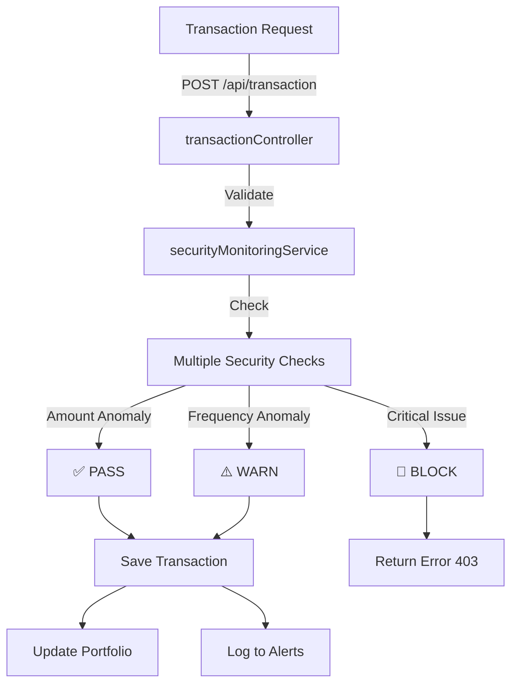

# 🚀 HomeRate Security Bots - Hızlı Başlangıç Kılavuzu

## ✅ Yapılan İyileştirmeler

HomeRate sentetik emtia borsası, aşağıdaki güvenlik botları ile geliştirilmiştir:

### Eklenen Hizmetler (Services)
1. ✅ **securityMonitoringService.js** - Merkezi güvenlik izleme ve doğrulama
2. ✅ **anomalyDetectionBot.js** - Anormal davranış tespiti
3. ✅ **priceManipulationBot.js** - Fiyat manipülasyonu ve pump&dump tespiti
4. ✅ **fraudDetectionBot.js** - Sahtekarl\u0131k ve hesap ele geçirilme tespiti
5. ✅ **ddosPreventionBot.js** - DDoS ve injection saldırıları engelleme

### Eklenen Routes (API Endpoints)
✅ **security.js** - Security monitoring dashboard ve bot yönetimi

### Eklenen Middleware
✅ **securityMonitoring.js** - Login ve aktivite kaydı middleware'leri

### Güncellenen Modeller
- ✅ **User.js** - Security fields eklendi
- ✅ **Transaction.js** - Security tracking fields eklendi

### Güncellenen Controllers
- ✅ **transactionController.js** - Transaction validation entegre edildi

### Güncellenen Server
- ✅ **index.js** - Tüm botlar otomatik başlatılıyor

---

## 🎯 Temel Özellikler

### 1. Real-Time Monitoring (Gerçek Zamanlı İzleme)
```javascript
// Tüm işlemler otomatik olarak doğrulanır
const securityValidation = await securityMonitoringService.validateTransaction(tx);

if (securityValidation.riskScore > 80) {
  // İşlem otomatik olarak bloklanır
}
```

### 2. Botlar 24/7 Çalışıyor
```
🤖 Anomaly Detection Bot - 5 saniye aralıkla
🤖 Price Manipulation Bot - 10 saniye aralıkla
🤖 Fraud Detection Bot - 15 saniye aralıkla
🤖 DDoS Prevention Bot - 10 saniye + gerçek zamanlı
```

### 3. Risk Scoring
```
Risk Score Aralığı: 0-100
0-30: ✅ GREEN (Güvenli)
30-60: 🟡 YELLOW (Uyarı)
60-80: 🟠 ORANGE (Riskli)
80-100: 🔴 RED (Bloklanmış)
```

---

## 📍 Server Başlatma

```bash
# Backend'i başlat
npm run dev:backend

# Veya production'da
npm run start:backend
```

**Başlangıç Logu:**
```
Server running on port 5000
🚀 Starting Security Bots...
✅ All security bots initialized and running
Security dashboard available at: http://localhost:5000/api/security/dashboard
```

---

## 📊 Dashboard Açma

```bash
# Güvenlik panosunu aç (Admin gerekli)
curl http://localhost:5000/api/security/dashboard \
  -H "Authorization: Bearer <ADMIN_TOKEN>"
```

**Cevap:**
```json
{
  "totalAlerts": 45,
  "criticalAlerts": 2,
  "highAlerts": 12,
  "botStatus": {
    "anomalyDetection": { "isRunning": true, ... },
    "priceManipulation": { "isRunning": true, ... },
    "fraudDetection": { "isRunning": true, ... },
    "ddosProtection": { "isRunning": true, ... }
  },
  "recentAlerts": [...]
}
```

---

## 🔍 Tespit Edilen Tehdit Türleri

### Anomaly Detection Bot
- ❌ İstatistiksel anomaliler
- ❌ Anormal işlem sıklığı
- ❌ Yeni symbol kullanımı
- ❌ Bot ağı desenleri

### Price Manipulation Bot
- ❌ Pump & Dump koordinasyonu
- ❌ Wash Trading
- ❌ Volatilite Spiği
- ❌ Volume anomalisi

### Fraud Detection Bot
- ❌ Brute Force giriş denemeleri
- ❌ Yeni cihazdan şüpheli giriş
- ❌ 2FA devre dışı bırakılması
- ❌ Rug Pull hazırlığı
- ❌ Bot network aktivitesi

### DDoS Prevention Bot
- ❌ DDoS saldırıları (100+ req/min)
- ❌ SQL Injection
- ❌ XSS saldırıları
- ❌ Port Scanner lar
- ❌ Rate limit ihlalleri

---

## 💾 Veritabanı

### Gerekli Indeksler (Otomatik oluşturulur)
```javascript
// Transaction Model
users.index({ userId: 1, createdAt: -1 })
users.index({ walletAddress: 1, createdAt: -1 })
users.index({ fromSymbol: 1, toSymbol: 1, createdAt: -1 })

// User Model
users.index({ email: 1 })
users.index({ 'walletAddresses.address': 1 })
users.index({ lastLoginAt: 1 })
```

---

## ⚙️ Yapılandırma (Environment Variables)

```.env
# Security Settings
SECURITY_ENABLED=true
ANOMALY_DETECTION_ENABLED=true
PRICE_MANIPULATION_DETECTION_ENABLED=true
FRAUD_DETECTION_ENABLED=true
DDOS_PROTECTION_ENABLED=true

# Rate Limiting
MAX_REQUESTS_PER_MINUTE=100
MAX_REQUESTS_PER_ENDPOINT=30

# Alert Settings
CRITICAL_ALERT_THRESHOLD=80
HIGH_ALERT_THRESHOLD=50

# IP Blocking
IP_BLOCK_DURATION_HOURS=1
```

---

## 🛡️ Transaction Flow



---

## 📈 Monitoring

### Tüm Uyarıları Getir
```bash
GET /api/security/alerts?limit=100
```

### Sadece Kritik Uyarıları
```bash
GET /api/security/alerts/critical
```

### Bloklanmış IP'leri Getir
```bash
GET /api/security/blocked-ips
```

### İstatistikleri Getir
```bash
GET /api/security/bots/anomaly-detection/stats
GET /api/security/bots/price-manipulation/stats
GET /api/security/bots/fraud-detection/stats
GET /api/security/bots/ddos-protection/stats
```

---

## 🔧 Bot Yönetimi

### Botları Başlat
```bash
POST /api/security/bots/anomaly-detection/start
POST /api/security/bots/price-manipulation/start
POST /api/security/bots/fraud-detection/start
POST /api/security/bots/ddos-protection/start
```

### Botları Durdur
```bash
POST /api/security/bots/anomaly-detection/stop
POST /api/security/bots/price-manipulation/stop
POST /api/security/bots/fraud-detection/stop
POST /api/security/bots/ddos-protection/stop
```

### İP Unblock Et
```bash
POST /api/security/unblock-ip
Content-Type: application/json

{
  "ip": "192.168.1.1"
}
```

---

## 📝 Log Örnekleri

### Success Logs
```
🤖 Anomaly Detection Bot started
🤖 Price Manipulation Detection Bot started
🤖 Fraud Detection Bot started
🤖 DDoS & Attack Prevention Bot started
✅ All security bots initialized and running
```

### Detection Logs
```
⚠️  ANOMALY DETECTED: FREQUENCY_ANOMALY - Anormal işlem sıklığı
🚨 PUMP ALERT: BTC/USDT - 8 consecutive upswings
🚨 DUMP ALERT: ETH/USDT - 8 consecutive downswings
🚨 BRUTE FORCE ATTACK: User 64a... - 5 failed attempts
🚫 IP BLOCKED: 192.168.1.100 - Possible DDoS Attack
```

---

## 🧪 Test Etme

### Anomaly Detection Testi
```bash
# Çok hızlı işlem yap (5 saniyede 3+)
for i in {1..5}; do
  curl -X POST http://localhost:5000/api/transaction \
    -H "Authorization: Bearer $TOKEN" \
    -H "Content-Type: application/json" \
    -d '{"fromSymbol":"GOLD","toSymbol":"USD","fromAmount":1000}'
done
```

### DDoS Test
```bash
# Çok sayıda request (Rate limit test)
for i in {1..150}; do
  curl http://localhost:5000/api/health &
done
```

---

## 🚨 Kritik Uyarılar vs Uyarılar

### Kritik (CRITICAL) - Risk Score > 80
- ❌ Replay Attack Tespit Edildi
- ❌ Çifte Harcama Tespiti
- ❌ 2FA Devre Dışı Bırakıldı
- ❌ DDoS Saldırısı
- ❌ Bot Network Tespit Edildi

**Action:** Otomatik olarak işlem bloklanır ve admin'e bildir

### Yüksek (HIGH) - Risk Score 50-80
- ⚠️ Fiyat Manipülasyonu
- ⚠️ Wash Trading
- ⚠️ Brute Force Giriş
- ⚠️ Hesap Ele Geçirilme

**Action:** İşlem kaydedilir ama ek kontrole tabi

### Orta (MEDIUM) - Risk Score 25-50
- 📋 Anormal Sıklık
- 📋 Yeni Cihaz
- 📋 Volume Spike

**Action:** Monitoringu artır

### Düşük (LOW) - Risk Score < 25
- 📊 Bilgi amaçlı uyarılar
- 📊 Trend analizi

**Action:** Logla ve devam et

---

## 📞 Troubleshooting

### Botlar başlamıyor
```bash
# MongoDB bağlantısını kontrol et
# Error Handler middleware'i kontrol et
# Port 5000'nin açık olduğundan emin ol

npm run dev:backend
```

### Uyarılar kaydedilmiyor
```bash
# Mongoose connection kontrol et
# Security service import'lerini kontrol et
# Database collection'ları kontrol et
```

### Rate limit çalışmıyor
```bash
# DDoS prevention bot'un started olduğundan emin ol
# Trust proxy ayarı kontrol et (app.set('trust proxy', 1))
```

---

## 📚 Daha Fazla Bilgi

Detaylı dokümantasyon için bkz: [SECURITY_BOTS_DOCUMENTATION.md](SECURITY_BOTS_DOCUMENTATION.md)

---

**Güvenlik Sistemi Versiyonu:** 1.0.0  
**Son Güncelleme:** 11 Şubat 2026  
**Sistem Durumu:** 🟢 Active

